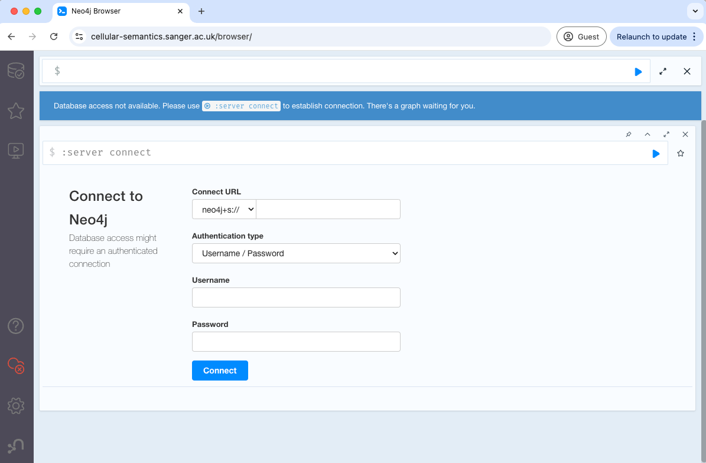
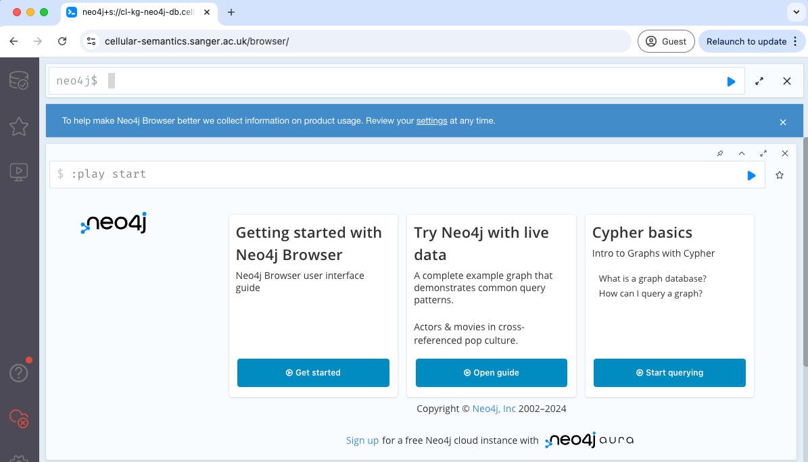

The following steps show how to access the Cell Type Knowledge Graph.

1. Open your preferred browser and visit the Neo4j instance by entering the following URL:
   ```
   https://cellular-semantics.sanger.ac.uk/browser/
   ```

   

2. In the **Connect URL** field, enter:

   ```
   cl-kg-neo4j-db.cellgeni.sanger.ac.uk:443
   ```

   

3. You don't need to enter any credentials. Simply click on the **Connect** button to proceed. You 
   will see the following screen once you connect.

    

4. After connecting, use the query box at the top of the interface to run your queries and 
   explore the Knowledge Graph (KG).

    